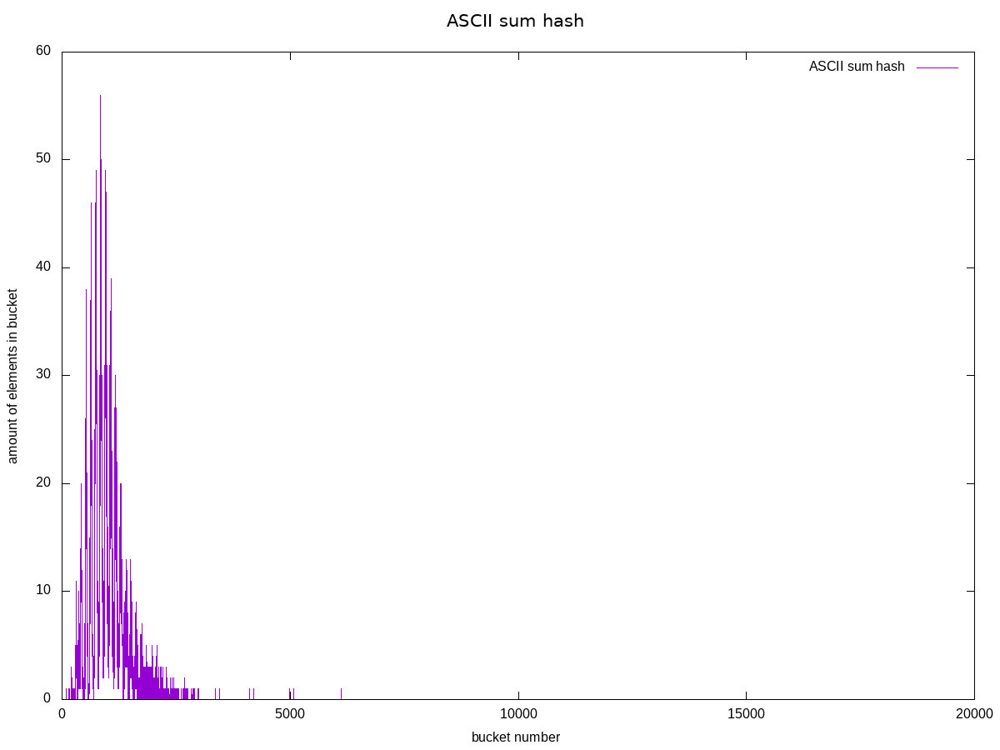
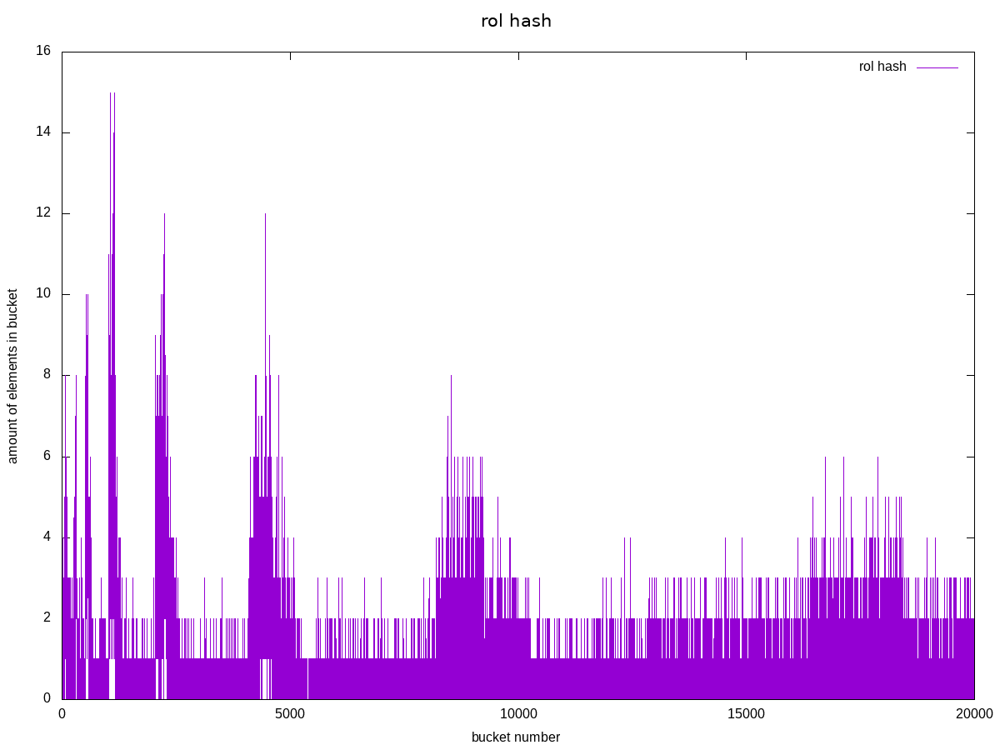
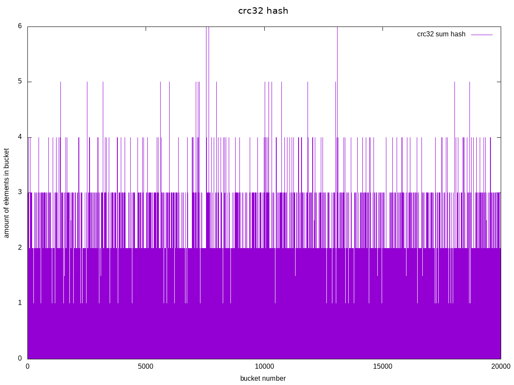
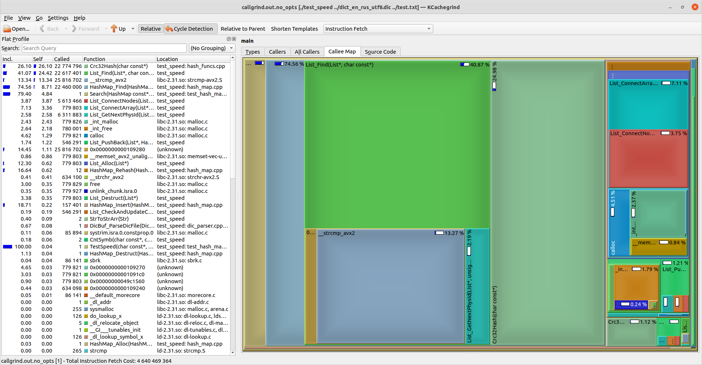
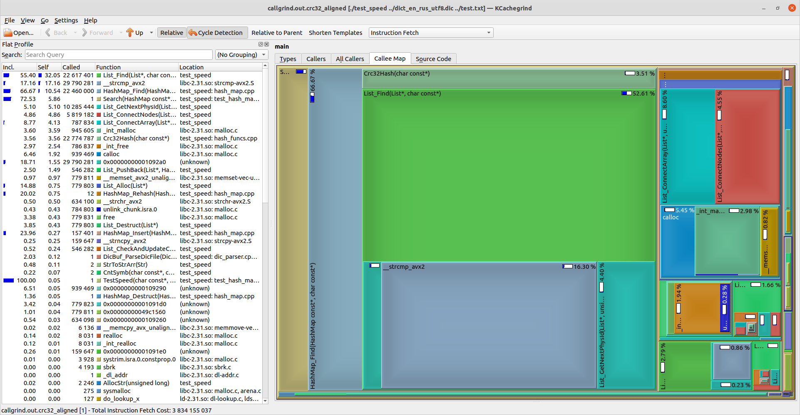

# Hashmap optimization

## Hash functions review

Firstly, let's check distributions of some hash functions:



As you can see, ASCII sum is very bad function, dispersion is 51.2172



That one much better, but not good enough. Dispersion is 38.9035



Crc32 shown best result, dispersion is 12.9213. We will use this hash function.

## Optimizations

Profiling with cachegrind showed most used and time wasting functions:



*Search time is `1.031824`

It's Crc32Hash function. To decrease its time, lets apply strings alignment. Now all strings cut to 64 symbols, so we can use `crc32` assembler instruction to count hash faster:
```
HashT Crc32Hash(const char* c_str) {
    assert(c_str);

    HashT hash = 0;
    __asm__("xor %0, %0\n"
            "crc32q (%1), %0\n" : "=r" (hash) : "r" (c_str));
    return hash;
}
```

Let's see results:


Hash function replaced to 9th place from 1st!

Search time: `0.842251`
